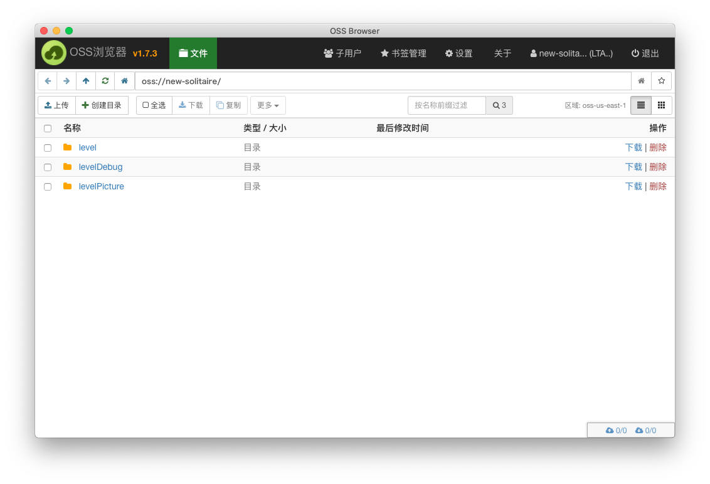
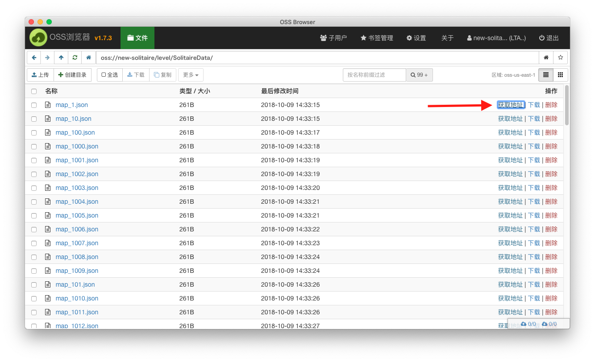

# 关卡内置更新规范 - 基于阿里云 OSS && CDN

## 目的

通过网络下载的方式，灵活更新关卡配置信息。

## 流程

1. 在 oss 上开通项目对应的 bucket，并关联对应的 CDN 加速服务。
2. 使用脚本工具处理需要上传的文件夹下的所有文件，并将其上传到对应的 oss 目录下。
3. 前端启动时抓取关卡的变动信息，比配后再下载需要更新的关卡文件。
4. 前端进入关卡优先使用下载的关卡配置。

## OSS 可视化工具

[相关文档和下载地址](https://help.aliyun.com/document_detail/61872.html?spm=5176.208357.1107607.33.6fe0390fMsnxYM)




## OSS 资源文件夹层级管理要求

`../gameLevel/${release/debug}/${apiVersion}/..`

    gameLevel: 表示关卡配置相关资源的总入口。

    release/debug: 用于区分运行环境是 debug 还是 release。

    apiVersion: 类似 restAPI 的接口定义。在关卡配置表结构有比较大的变动，只有新版的客户端才能支持使用时，通过这个 version 来区分新旧客户端请求的配置信息。

## OSS 资源上传脚本工具

基于 OSS 的 [python SDK](https://help.aliyun.com/document_detail/32026.html?spm=a2c4g.11186623.6.744.45f15352A9X6xO) 进行封装。主要需要实现一下功能：

1.遍历指定的文件夹下所有文件，生成每个文件的 md5 信息和文件路径信息关联。

2.按 YYYY(年) MM(月) DD(日)记录一个版本信息。

3.将步骤 1 和 2 记录的信息，生成如下格式的 check.json 文件。

```json

{
  version: ${YYYYMMDD} //使用number类型
  files: [
    {
      file: 'path',
      md5: 'string'
    },
    {
      file: 'path',
      md5: 'string'
    },
    ...
  ]
}
```

4.将需要上传的文件夹通过 OSS SDK 功能上传到对应的网络路径下，注意使用 SDK 的 md5 验证功能，保证文件的完整性。

<font color=red> 注意：先上传所有文件，确保所有文件都更新成功后，再更新 check.json</font>。

5.在 OSS 可视化工具中，确认上传文件的情况。

## CDN 下载路径

所有上传到 OSS 都会有一个唯一的下载地址



将一级地址替换为对应的 CDN 地址，就是走 CDN 加速的下载地址。大概的格式如下：

`https://${CDN地址}/gameLevel/${release/debug}/${apiVersion}/${OSS下的完整路径}`

<font color=red> 注意：每个项目的 CDN 地址向管理员确认。</font>。

## 客户端的流程

### 客户端下载资源的管理

1.下载的资源按对应的路径层级存放在本地 download 文件夹下。
`${allPath}/download/gameLevel/${release/debug}/${apiVersion}/${OSS下的完整路径}`。

2.下载的资源只要是同一个 apiVersion 文件夹下的，新的文件可以覆盖旧的文件。

### 客户端下载流程

1.客户端启动后，首先拉取 check.json 文件，如果本地已经记录的 version 信息与拉取到的 version 信息不一致，执行下面的步骤。

2.使用 check.json 中的信息, 对比本地对应 ${apiVersion} 文件下的所有文件， md5 发生变动的文件为需要更新的文件，放入待更新队列。

3.所有文件检测完成后，开始下载需要更新的文件到一个临时 tmp 文件夹。

4.所有文件都下载完成后，检测 md5 是否正确。所有检测通过后覆盖 ${apiVersion} 下的原文件。

5.将 check.json 文件中的 version 记录下来，用于下次匹配。

## 特别说明

一、在check.json里面为什么要保存一个version信息？

``` text
在每次关卡有更新后，策划需要在统计系统里面去分析更新前后的关卡差别。
所以在关卡统计的相关事件里，都增加一个属性(gameLeveVersion，值为0)来记录所处关卡对应的version信息。
这样策划在关卡相关事件分析时，就可以筛选需要关注的version信息。
version之所以要是number类型，也是为了方便做大于，等于，小于选。
```

二、apiVersion 和 check.json 文件中的 version 字段的区别？

``` text
apiVersion 主要是从兼容性上考虑做的版本区分，只有在旧版本无法新的关卡配置表时才会切换到新的版本编号下。
命名规范使用 ${大版本}.${小版本} 比如1.0,1.5,2.0等

check.json 文件中的 version 字段主要是在每次关卡数据有更新时做的一个版本标记, 命名规范使用 ${YYYYMMDD} 比如 20181014。
在关卡相关事件统计时，作为参数传入。便于策划在后续事件分析时，区分新旧关卡数据。
```