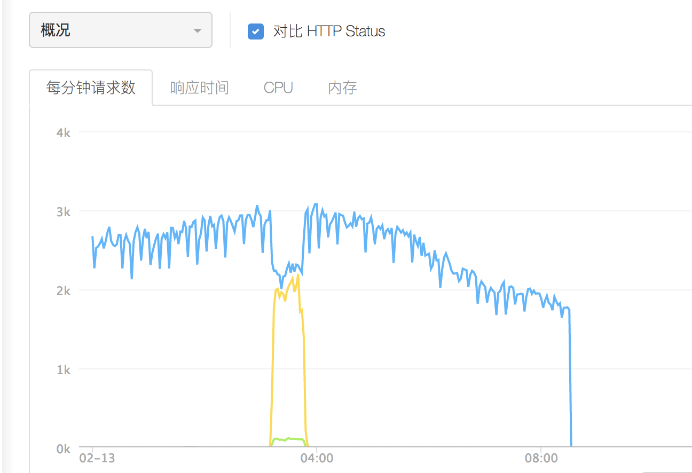
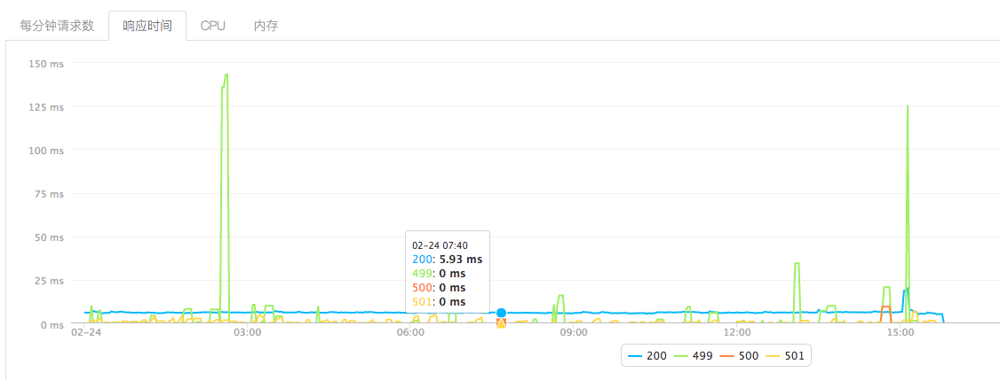
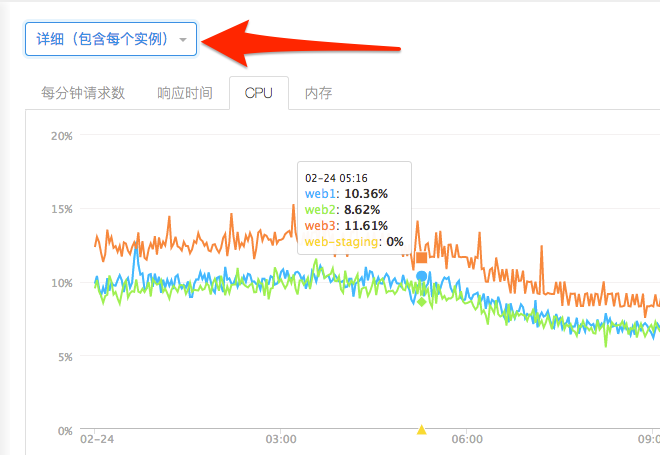
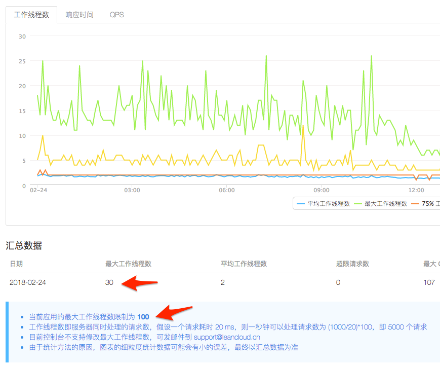
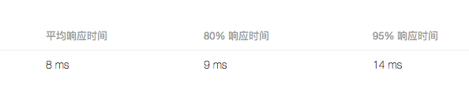
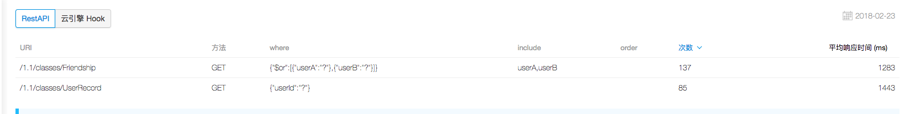
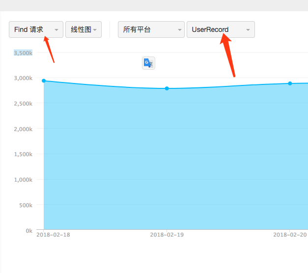
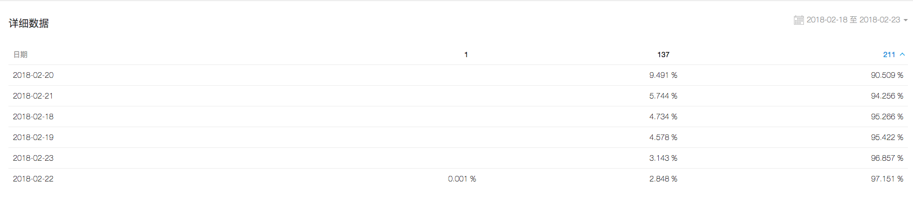

# 服务器运行状态每日例行检查规范

服务器除了有自动的运维监控外，还需要每日进行例行的状态检查，以便尽早的发现一些问题，反馈到leancloud那边。

## 云引擎检查

### 应用日志

首先在应用日志里面参考过去一天有没有明显的报错信息。通过错误的堆栈信息来定位具体的问题。

### 统计

在统计数据里面，主要确认一下几个方面的信息：

#### 1.每分钟请求数

确认在过去一天里，每分钟请求数有没有异常的波动，以及在某个时间段里面有没有出现明显的异常增多。

### 2.响应时间

在某个时间段有异常明显增多的时候，在该时间段的响应时间会明显变长。主要是要确保200响应速度在一个较快的范围内。

### 3.CPU与内存

CPU和内存状态的查看要切换到--详细（包含每个实例），这样才能看到每个实例的运行状态，正常情况下CPU和内存应该保持在降低的状态值下，如果出现业务处理的堆积可能会引起内存和CPU的异常，应当及时予以处理。

### 4.LeanCache

LeanCache主要需要关注的是预期设置的缓存池大小是否够用。

比如设置一个用来缓存用户数据的缓存池，数据的过期时间设置的是5天。如果出现5天内这个缓存池就被装满了。则说明缓存池大小不足要予以扩容。

或者用来做常量缓存的缓存池，出现了快满的情况，也要予以及时的扩容。

## 存储服务检查

在存储服务的统计页面主要需要关注一下各项指标。

### 1.性能总览

#### 工作线程数

在这个页面主要关注汇总数据，在过去一天里面，是否出现了最大工作线程数超过限制的情况。如果是因为业务量变大而超过限制，应当向leancloud那边申请调高最大限制数。

#### 响应时间

响应时间主要关注以上三个数据，并结合图表，在发现明显的响应时间变长时，应当及时予以反馈。

### 2.慢查询

这里主要是记录的响应时间超过500ms的数据库查询。如果出现较多的次数，一定反馈给leancloud，让其帮忙优化。

### 3.API请求数

这里主要可以看到每日的存储服务 API调用次数。因为leancloud的存储服务收费是按照API调用次数来产生的。

在存储服务器API调用次数增长较快时，首先是找到是具体哪个Class的调用次数增长较快。其次是确认那种类型的API调用增长较多，如果是Find请求增长较多，应当考虑使用redis缓存热数据，来减少Find的请求次数。

在redis缓存池增加后，也需要关注对应Class的Find请求次数是否有明显的下降，如果没有达到效果，应该具体分析原因。

### 4.Code 错误码

这里显示的是每日存储服务执行时产生的错误Code比例记录，每个Code的含义在leancloud文档里面有具体的解释。

[leancloud错误码详解](https://leancloud.cn/docs/error_code.html)

具体关注下，产生的错误code有没有预期以外的。如果有并且比例较高时，应当及时予以处理。

## 总结

每日应当对主要的几个线上服务做例行的检查，这并不会花太多的时间。主要目的是尽早的发现一些潜在的问题。如果发现异常应当及时的反馈给leancloud，以便尽快的修复。
