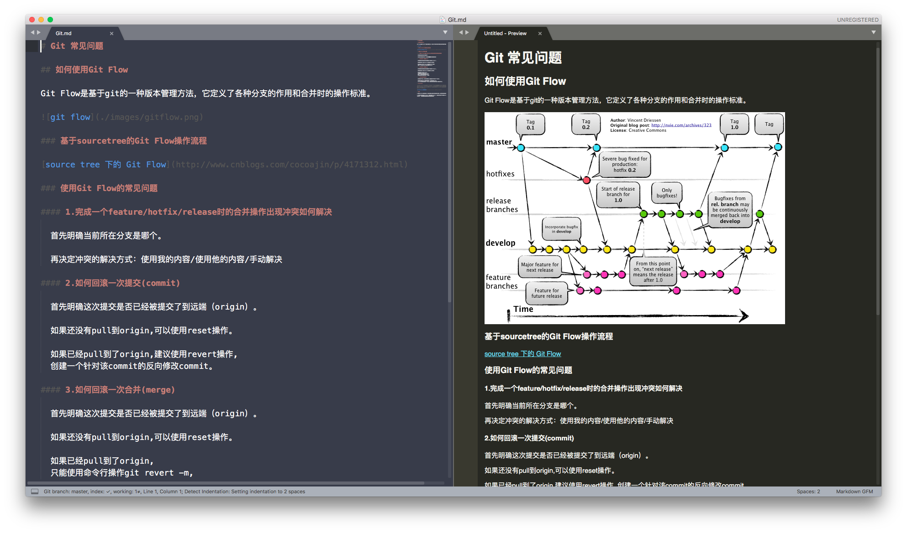
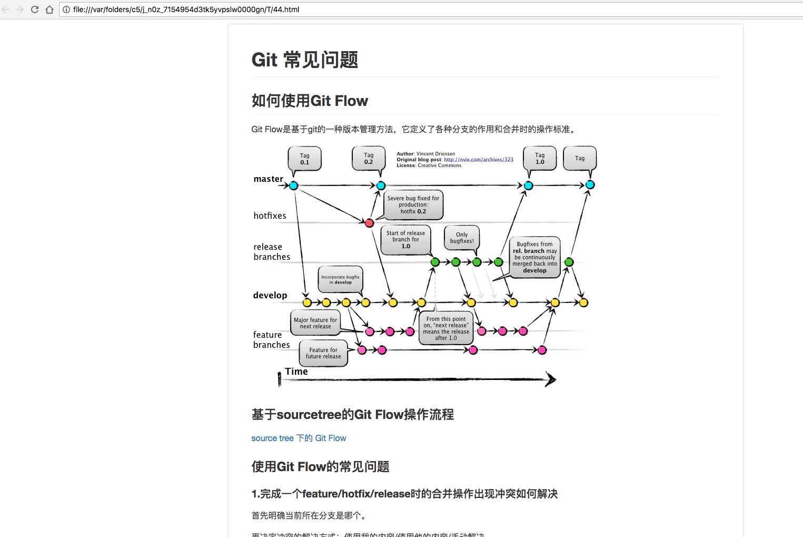
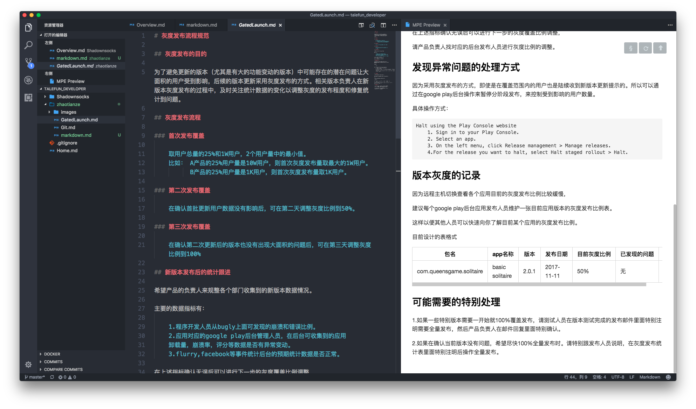

# Markdown文档说明

## 编辑器支持

### Sublime Text安装过程

#### 安装准备：

  找到菜单栏：Preferences → Package Control → Package Control:Install Package；
  没有找到Package Control，那么点击[Package Control](https://packagecontrol.io/) 安装吧，安装完重启Sublime。

#### 安装过程：

  需要的插件：

  [Markdown Editing](https://packagecontrol.io/packages/MarkdownEditing) ：编辑器插件，必须安装。

有2个预览插件可以选择安装：
  [MarkdownLivePreview](https://packagecontrol.io/packages/MarkdownLivePreview):打开md文件的时候，直接左右屏显示编辑窗口和预览页面。但是对列表显示的支持不好。

  

  [Markdown Preview](https://packagecontrol.io/packages/Markdown%20Preview):打开一个网页来显示预览画面。

  

  在Package Control → Install Package中输入插件的名字，找到相应插件，点击即可自动完成安装，安装完重启Sublime；

  简单设置：Preferences → Package Settings → MarkdownLivePreview → Setting，打开后将左边default的设置代码复制到右边User栏，找到"markdown_live_preview_on_open": false,把false改为true，保存。

### VSCode 自带支持，不需要额外安装。

## markdown书写文档规范

markdown支持的各种语法说明请参考这里：[点击前往](http://blog.leanote.com/post/freewalk/Markdown-%E8%AF%AD%E6%B3%95%E6%89%8B%E5%86%8C)